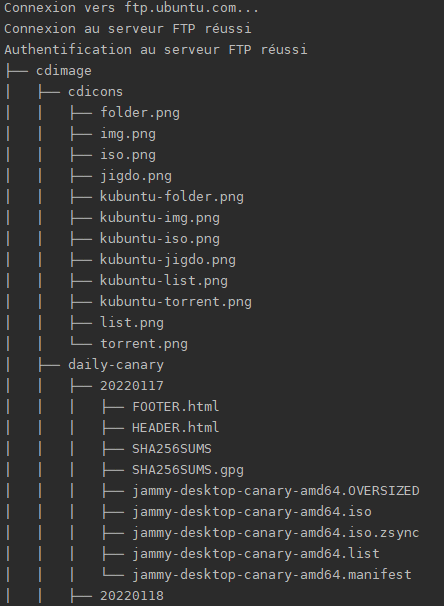
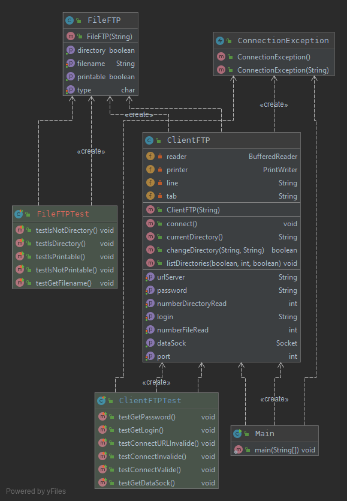

# Tree-FTP-POCHET

**Auteur :** Antoine Pochet, antoine.pochet.etu@univ-lille.fr <br>
**Date de début :** 04/02/21 <br>
[Vidéo du projet](docs/video.mp4)

Vous pouvez retrouver les differentes ressources dans le repertoire [docs](./docs) et la documentation javadoc dans le repertoire [docs/javadoc](./docs/javadocs). Le programme peut être appelé avec des paramètres, comme la profondeur à laquelle nous voulons lister les fichiers, l'affichage des fichiers cachés ou même permettre un affichage JSON.

## Presentation du projet : 

**Tree FTP** est un programme codé en Java qui permet de lister le contenu d'un serveur FTP distant grâce au protocole [File Transfer Protocole](https://fr.wikipedia.org/wiki/File_Transfer_Protocol) (FTP). Le listing du serveur se base sur la [commande](http://www.delafond.org/traducmanfr/man/man1/tree.1.html) `tree`.

*(Aperçu du resultat de Tree-FTP)* <br> 



## Utilisation :

Pour lancer l'application il suffit de se placer dans le répertoire où se trouve le jar, et d'écrire :
```
    java -jar Tree-FTP-POCHET.jar NomDuServerFTP
```
Certains serveurs FTP permettent de se connecter en tant que visiteur, cependant, d'autres serveurs peuvent nécessiter un identifiant et un mot de passe. Dans ce cas, vous devez écrire votre identifiant et votre mot de passe après le nom du serveur :
```
    java -jar Tree-FTP-POCHET.jar NomDuServerFTP Login Password
```

Pour la profondeur souhaitée, il est nécessaire d'ajouter l'option `-p={profondeur}`,
Si vous souhaitez afficher l'arborescence sans limite de profondeur, définissez simplement ce paramètre sur -1 `-p=-1` ou ne spécifiez aucune option. <br> 
**REMARQUE** Si votre serveur FTP contient un grand nombre de fichiers et que vous ne limitez pas la profondeur, les résultats du programme peuvent être très longs

```
    java -jar Tree-FTP-POCHET.jar NomDuServerFTP Login Password -p=4
```


Vous pouvez activer l'affichage des fichiers cachés avec l'option `-a` :
```
    java -jar Tree-FTP-POCHET.jar NomDuServerFTP Login Password -p=2 -a
```

Vous pouvez activer l'affichage en .json avec l'option `-j` :
```
    java -jar Tree-FTP-POCHET.jar NomDuServerFTP Login Password -p=2 -a -j
```

## Architecture :
*UML du projet :* <br> 


### Lister et expliquer la gestion d'erreur :

Dans ce projet, il y a une Classe qui extends Exception. <br>
ConnectionException : permet de relever les erreurs durant la connection et l'authentification du serveur. <br>

Il y a un try/catch pour afficher une erreur lorsqu'il y a un probleme avec la connection de la socket (nom de domaine ou port incorrect par exemple).

## Code samples :
On peut voir ici une partie du code de la fonction recursif listDirectories.
Elle liste le repertoire courant et pour chaque fichier (La classe file nous permet de savoir le type de fichier). Dans tous les cas le fichier est affiché mais si le fichier est un repertoire alors on rentre dedans et on rappelle listDirectories pour le lister.
```
public void listDirectories(boolean hideFile, int depth, boolean json) throws IOException {
  // Création de la socket pour récupérer les données du serveur FTP
  [...]
  // On envoie la méthode LIST ou LIST -a (pour les fichiers cachés) au serveur pour qu'il retourne les fichiers et dossier contenu
  [...]
  //On créer les données dont on a besoin dans la boucle
  [...]

  //Tant que ce le file que le socket nous envois est différent de null on continue
  while (files != null) {
    //On créer un FileFTP avec le string donnée par la socket
    FileFTP fileFTP = new FileFTP(files);
    files = dataReader.readLine();

    //Si le fichier est affichable (n'est pas l'un des deux repertoire : (. ou ..))
    if (fileFTP.isPrintable()) {
      // Si files == null cela veut dire que l'on est a la fin du répertoire (on change juste le format System.out.println)
      if (files != null) {
      //Si c'est un répertoire on l'affiche et on incrémente le compteur (meme chose pour les fichiers)
        
        [...]    
      }
    // Sinon c'est un lien symbolique et on l'affiche
    }else {

        [...]   

    }

    //Si le File est un répertoire
    if (fileFTP.isDirectory()) {
      //Et si on réussi a rentrer dans le répetoire grâce à la commande 'CWD'
      if (changeDirectory(fileFTP.getFilename(), currentDirectory) && fileFTP.isPrintable()) {
        
        [...]

        // On fait appel a notre même fonction en récursif
        if (depth != 0) listDirectories(hideFile, depth-1, json);
      }
    }

    [...]
    dataSocket.close();
    }  
} 
```
